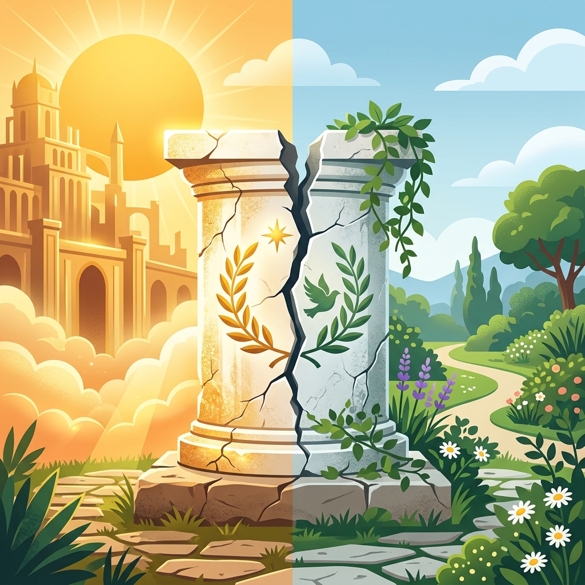
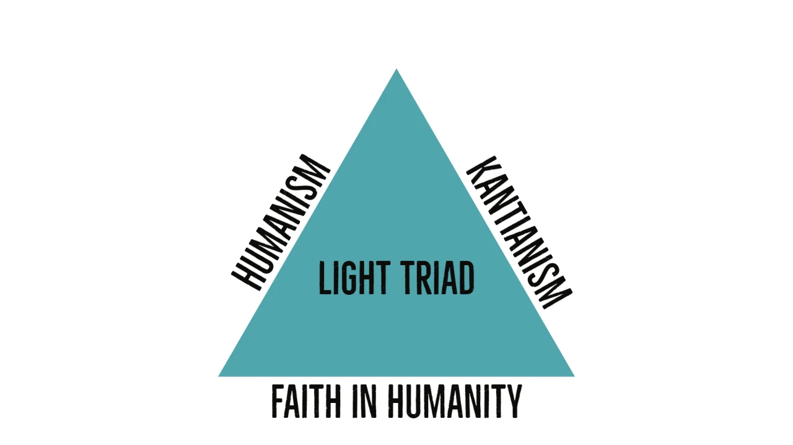

I consume a lot of stories. Whether I am deep in a sprawling sci-fi novel, watching the chaotic, ego-driven ambition of tech startups in shows like *Silicon Valley* and *Mythic Quest*, or following Monkey D. Luffy’s relentless pursuit of his dreams in the anime *One Piece*, I spend a lot of time observing characters chasing their destinies.

But every so often, a line of dialogue transcends the screen or the page and just lodges itself in my brain. Two quotes, completely separated by genre and medium, have been echoing in my head recently. They both strike at the exact same uncomfortable truth about the human condition.

The first is from Cyrus Beene, the ruthless political operator in the TV show *Scandal*:

> *"Some men aren’t meant to be happy; they’re meant to be great."*

The second is from Lorn au Arcos, the battle-hardened mentor in Pierce Brown’s *Red Rising* books:

> *"I would not have raised you to be a great man. There is no peace for great men. I would have raised you to be a decent one."*

When you place those two thoughts side by side, they form a devastating map of human ambition. They tell us that we cannot have it all. We must choose.

We are conditioned to believe that we can have it all, but the reality is that we must make sacrifices. The question is, what are we willing to sacrifice?
History does not remember happy men, and power does not reward decent ones.
## The Dark Triad and the Cost of "Greatness"

As someone who is just trying to build a life, I see the cultural obsession with "greatness" everywhere. In today's world, that greatness is almost exclusively equated with money and status. We are conditioned to revere the billionaires, the relentless hustlers, and the people who accumulate the most wealth and power. We are sold the idea that to be successful, we have to dominate.

But psychology tells us a darker story about what it actually takes to be Cyrus Beene’s "great man." When researchers study historical titans and modern tycoons, they frequently find the **Dark Triad** of personality traits:

* **Narcissism:** The unshakable, reality-distorting belief in one's own superiority.
* **Machiavellianism:** The willingness to treat people like pieces on a chessboard to achieve a goal.
* **Psychopathy:** An emotional numbness that allows someone to make ruthless decisions without the paralyzing weight of empathy.

To leave a massive dent in the universe, or just to amass a fortune, you usually have to operate outside the bounds of normal human morality. You have to sacrifice your peace, your relationships, and often, your soul. It boils down to a brutal sociological reality: **History does not remember happy men, and power does not reward decent ones.**

## The Light Triad and the Courage of "Decency"

Then there is Lorn’s alternative: *Decency*.

Decency isn't about weakness; it is an active, daily choice. It aligns with what psychology calls the **Light Triad**:

* **Humanism:** Valuing the dignity of every person you meet.
* **Kantianism:** Refusing to manipulate others for your own ends.
* **Faith in Humanity:** Believing that people are fundamentally good.

To be a decent man is to prioritize the people right in front of you over the abstract judgment of history or the pursuit of endless wealth. It means building trust, acting with integrity, and finding contentment in connection rather than conquest. But the trade-off is steep. The decent man rarely gets statues built in his honor. He gets something quieter: peace.

## The *One Piece* Anomaly: Greatness Without Conquest

While many of our stories frame greatness as an inescapable tragedy, the anime world sometimes offers a fascinating counter-argument. This brings me back to Monkey D. Luffy, who represents a bizarre, wonderful anomaly in this framework.

Luffy is chasing the ultimate title of "greatness" in his world: the Pirate King. By all traditional metrics, acquiring that title should require intense Dark Triad traits. Yet, Luffy operates purely on the Light Triad. He vehemently rejects Machiavellianism; he refuses to sacrifice his crew or manipulate his allies. He lacks the narcissism of a conqueror. When asked if he wants to conquer the seas, Luffy responds: *"I don't want to conquer anything. I just think the guy with the most freedom in this ocean is the Pirate King!"*

Luffy blends the ambition for greatness with a fundamental decency. He shows us a fantasy where power isn't about control over others, but about the absolute freedom to protect the people you love. I guess that's why it's a great fantasy series.

## What We Pass On

As we grow up, transitioning from being children to eventually having children of our own, we will watch our children grow up and figure out their little worlds. Watching them play and just exist so happily, Lorn’s quote takes on a heavier weight.

Instinctively, we want the next generation to be "great." We want them to be exceptional, to achieve incredible things, to have their names remembered. But when you really examine the sociological and psychological machinery of greatness: the isolation, the ego, the moral compromises, you have to ask if that is a curse disguised as a blessing.

I love a good story about a great, tragic hero. But in the real world? History can keep its great men. We are better off raising decent ones.
